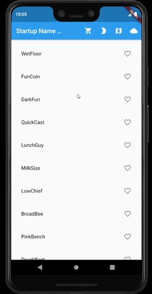

# flutter_first_app

A flutter starter app to learn from google codelab.

## Walkthough

## Getting Started

This project is a starting point for a Flutter application.

A few resources to get you started if this is your first Flutter project:

- [Lab: Write your first Flutter app](https://flutter.dev/docs/get-started/codelab)
- [Cookbook: Useful Flutter samples](https://flutter.dev/docs/cookbook)
- Write your first Flutter app, part 1
- Write your first Flutter app, part 2
- [Adding dynamic theme to toggle theme](https://proandroiddev.com/how-to-dynamically-change-the-theme-in-flutter-698bd022d0f0)

For help getting started with Flutter, view our
[online documentation](https://flutter.dev/docs), which offers tutorials,
samples, guidance on mobile development, and a full API reference.
